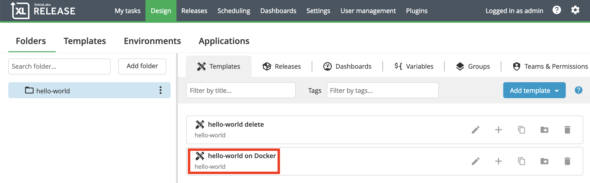

# Local Docker Deployment

## Introduction

Use this blueprint to deploy a Docker application with front-end and back-end services to Docker running locally. The release template that the blueprint generates will deploy the application and optionally undeploy it. Then, follow the simple exercises that build on each other to add more blueprint features.

## Before you get started

If you're new to XebiaLabs blueprints, check out:

* [Get started with DevOps as Code](https://docs.xebialabs.com/xl-platform/concept/get-started-with-devops-as-code.html)
* [Get started with blueprints](https://docs.xebialabs.com/xl-platform/concept/get-started-with-blueprints.html)
* [Get started with XL JetPack](https://docs.xebialabs.com/xl-platform/concept/get-started-with-xl-jetpack.html)

## How to use this example:

### 1. Start the XLD/XLR Docker images
```plain
~/blueprints-workshop $ cd docker
~/blueprints-workshop/docker $ docker-compose up
```

> **Note:** Make sure that `xl-cli_1` exits with code 0:
> `docker_xl-cli_1 exited with code 0`
> If not, run `docker-compose up -d xl-cli` in a separate window before proceeding

### 2. Create a temporare 'scratch' directory next to this repo for the blueprint's output files
```plain
~/blueprints-workshop/docker $ cd ../..
~ $ mkdir blueprints-workshop-scratch
~ $ cd blueprints-workshop-scratch
```

### 3. Run the blueprint

#### Linux / Mac
```plain
~/blueprints-workshop-scratch $ xl blueprint -b ../blueprints-workshop/repository/example-01
```

#### Windows
```plain
C:\blueprints-workshop-scratch> xl.exe blueprint -b ..\blueprints-workshop\repository\example-01
```

### 4. Answer the prompts
Follow the instructions and fill in the questions (or just accept the defaults)

### 5. Apply the configs to XLR / XLD
```plain
~/blueprints-workshop-scratch $ xl apply -f xebialabs.yaml
```

### 6. Deploy the application from XLR
Create a release from `hello-world on Docker` (or whatever you named your application) and deploy it.



### 7. Make the changes
There are 3 more exercises, each building on the other:

#### 7.1 Make the test phase optional
In this step we will:
* Add a `pattern` to validate the two port inputs
* Make the test phase optional with a `Confirm`
* Use `dependsOnTrue` to skip the phase color question if no test phase is created
* Variable interpolation using `{{.Value}}`

Open `blueprint.yaml` in an editor and add the `pattern` elements and the new optional section:
```yaml
  20: default: 80
+ 21:    pattern: "^()([1-9]|[1-5]?[0-9]{2,4}|6[1-4][0-9]{3}|65[1-4][0-9]{2}|655[1-2][0-9]|6553[1-5])$"
  22:  - name: HostPort

...

  25:    default: 8181
+ 26:    pattern: "^()([1-9]|[1-5]?[0-9]{2,4}|6[1-4][0-9]{3}|65[1-4][0-9]{2}|655[1-2][0-9]|6553[1-5])$"
  27:  - name: BackendDockerImage

...

  34:    default: "xebialabsunsupported/rest-o-rant-web"
+ 35:  - name: RunTestPhase
+ 36:    type: Confirm
+ 37:    description: Do you want to have a test phase?
+ 38:  - name: TestPhaseColor
+ 39:    type: Input
+ 40:    description: What color would you like the test phase to be?
+ 41:    default: "#FF0000"
+ 42:    pattern: "^#([A-Fa-f0-9]{2}){2}[A-Fa-f0-9]{2}$"
+ 43:    dependsOnTrue: RunTestPhase
```

Open `xlr-pipeline.yaml.tmpl` in an editor and add the following `if` statement and variable interpolation:
```yaml
  29                deploymentEnvironment: Environments/{{$app}}/Local Docker Engine
+ 30          {{ if (.RunTestPhase)}}
  31          - name: Test
+ 32            color: '{{.TestPhaseColor}}'
  33            type: xlrelease.Phase
  34            tasks:
  35              - name: Test the {{$app}} application
  36                type: xlrelease.Task
  37                team: Release Admin
  38                description: |
  39                  The {{$app}} app is now live on your local Docker Engine. Open the following link in a new browser tab or window:
  40                  http://localhost:{{.HostPort}}/
+ 41          {{end}}
  42      - name: {{$app}} delete
```

> Note: You can diff your changes with `example-02`

Now re-run the `xl blueprint`, and you will notice the new prompts. Choose `no`, then `xl apply` and see in XLR that the test phase is absent. Run it again, choosing `yes` this time and supply a hex colour value (notice the pattern). You should see the test phase in XLR with the colour you specified.

#### 7.2 `Select`s and `default` values
In this step we will:
* Change each Docker image input into a `Select`
* Give each one a `default` value

Open `blueprint.yaml` in an editor and change the following lines to the `Select` and `default` elements:
```yaml
  27  - name: BackendDockerImage
+ 28    type: Select
+ 29    options:
+ 30    - xebialabsunsupported/rest-o-rant-api:v1
+ 31    - xebialabsunsupported/rest-o-rant-api:latest
  32    description: What is the Docker Image (repo and path) for the Backend service?
+ 33    default: "xebialabsunsupported/rest-o-rant-api:latest"
  34  - name: FrontendDockerImage
+ 35    type: Select
+ 36    options:
+ 37    - xebialabsunsupported/rest-o-rant-web:v1
+ 38    - xebialabsunsupported/rest-o-rant-web:latest
  39    description: What is the Docker Image (repo and path) for the Frontend service?
+ 40    default: "xebialabsunsupported/rest-o-rant-web:latest"
  41  - name: RunTestPhase
```

> Note: You can diff your changes with `example-02`

Now re-run the `xl blueprint`, and you will see the blueprint ask you to select an image rather than type one in. Choose `v1`, then `xl apply` and see in XLR that the test phase is absent.

## Tools and technologies

This blueprint includes the following tools and technologies:

* Target:
    * [Docker](https://www.docker.com/)
* Tools:
    * [XebiaLabs Release Orchestration](https://xebialabs.com/products/xl-release/)
    * [XebiaLabs Deployment Automation](https://xebialabs.com/products/xl-deploy/)
* Application or framework:
    * [Sample application API component](https://hub.docker.com/r/xebialabsunsupported/rest-o-rant-api)
    * [Sample application web component](https://hub.docker.com/r/xebialabsunsupported/rest-o-rant-web)

## Minimum Required versions

This blueprint version requires at least the below versions of the specified tools to work properly.

XL Release: Version 8.6
XL Deploy: Version 8.6.1
XL CLI: Version 8.6

## Prerequisites

To run the YAML that this blueprint generates, you need:

* XebiaLabs Release Orchestration and Deployment Automation up and running
* A local Docker installation up and running

## Information required

This blueprint requires:

* The application name
* The port where the application should be exposed
* Docker images for a front-end and back-end service

## Output

This blueprint will output:

* Release template
* Docker infrastructure
* A docker-compose setup for XL Release, XL Deploy & Docker proxy

## Tips and tricks

* Before using this blueprint, ensure that you have a front-end and a back-end application service packaged in Docker containers.
* The YAML that the blueprint generates includes optional steps to remove the application.

## Basic structure of a blueprint directory

    [blueprint directory/]
    ├── xebialabs/
    │   └── USAGE.md
    │
    ├── blueprint.yaml
    ├── README.md
    └── xebialabs.yaml

## Examples

This project consists of 4 examples, each building on the previous and showcasing a different aspect of blueprints. Though not comprehensive, they should serve as a springboard.

### example-01
* Introduces a basic blueprint taken from [Simple Demo App](https://github.com/xebialabs/blueprints/tree/development/docker/simple-demo-app)
  * Basic template (`.tmpl` file)
  * Variable interpolation
  * Text `Input` type
* Deploys a simple backend and frontend

### example-02
* Introduces the blueprint concepts of:
  * Patterns
  * boolean `Confirm`
  * `dependsOn` logic

### example-03
* Introduces the blueprint concepts of:
  * `Select` type
  * Default values

### example-04
* Introduces the blueprint concepts of:
  * Non-interactive fields using `value`
  * Basic `!expression`s

## Further reading

* [Get started with XebiaLabs blueprints](https://docs.xebialabs.com/xl-platform/concept/get-started-with-blueprints.html)
* [Blueprint YAML format](https://docs.xebialabs.com/xl-platform/concept/blueprint-yaml-format.html)
* [Tutorial for deploying an application to AWS using a blueprint](https://docs.xebialabs.com/xl-platform/how-to/deploy-to-aws-using-blueprints.html)
* [Offical Blueprints docs](https://github.com/xebialabs/xl-cli/blob/master/docs/blueprints.md)

## Labels

* Docker
